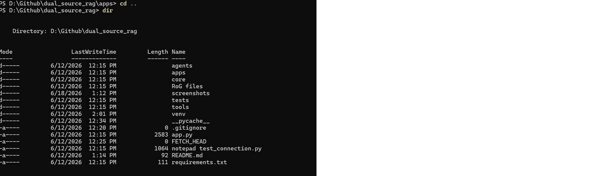
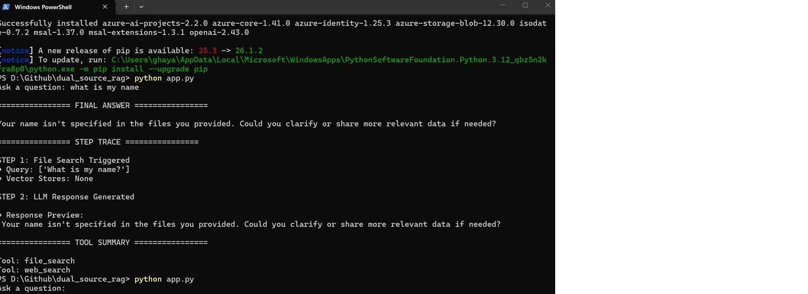
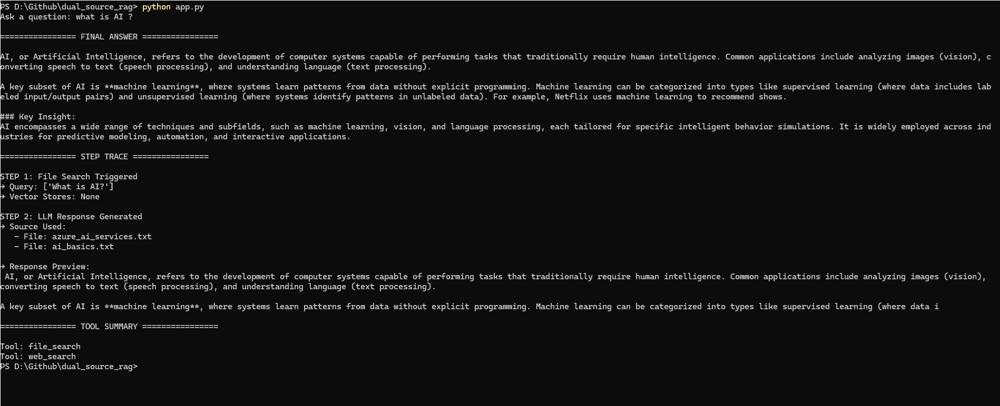

#  RAG Agent Lab

This is an experimental project exploring **Retrieval-Augmented Generation (RAG)** and **multi-agent AI systems** using Python.

The project is designed for learning and experimentation with:
- RAG pipelines
- Embedding-based retrieval
- AI agent orchestration
- LLM integration
- Vector search concepts

This is NOT a production system. It is a research/learning lab.

---

##  Features

- Document ingestion pipeline
- Embedding-based vector retrieval
- LLM-based response generation
- Modular agent structure
- Experimentation with AI tool calling
- Local development setup

---

##  Project Structure

```
rag-agent-lab/
│
├── agents/                # AI agent logic
├── tools/                 # Utility tools (retrieval, embedding, etc.)
├── models/                # Data models and schemas
├── data/                  # Input documents / datasets
├── vector_store/         # Stored embeddings
├── config/                # Configuration files
├── main.py               # Entry point
├── requirements.txt      # Dependencies
└── README.md
```

---

##  Setup Instructions

### 1. Clone the repository
```bash
git clone https://github.com/Ghayas0772/rag-agent-lab.git
cd rag-agent-lab
```

### 2. Create virtual environment
```bash
python -m venv venv
```

### 3. Activate environment
**Windows:**
```bash
venv\Scripts\activate
```

### 4. Install dependencies
```bash
pip install -r requirements.txt
```

---

##  Run the project

```bash
python main.py
```

---

##  Tech Stack

- Python 3.12
- OpenAI / Azure OpenAI (optional)
- FAISS / Vector Search (if used)
- LangChain / custom agent framework (if used)

---

##  Purpose

This project is built for:
- Learning RAG architecture
- Experimenting with AI agents
- Understanding vector databases
- Building multi-agent systems

---

## 📸 Demo Screenshots

### 1. Project Setup / File Structure


---

### 2. Run Project Execution


---

### 3. User Input Execution


---

### 4. Dashboard Home / Initial UI


---

### 5. User Search / Input Interaction


---


##  Disclaimer

This is a research project and may contain experimental code not suitable for production use.

---

##  Author

Ghayasudin Ghayas  
MS Data Science | AI & Machine Learning Enthusiast
